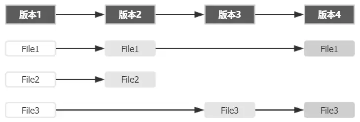
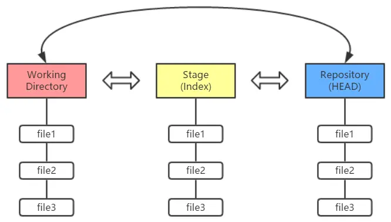
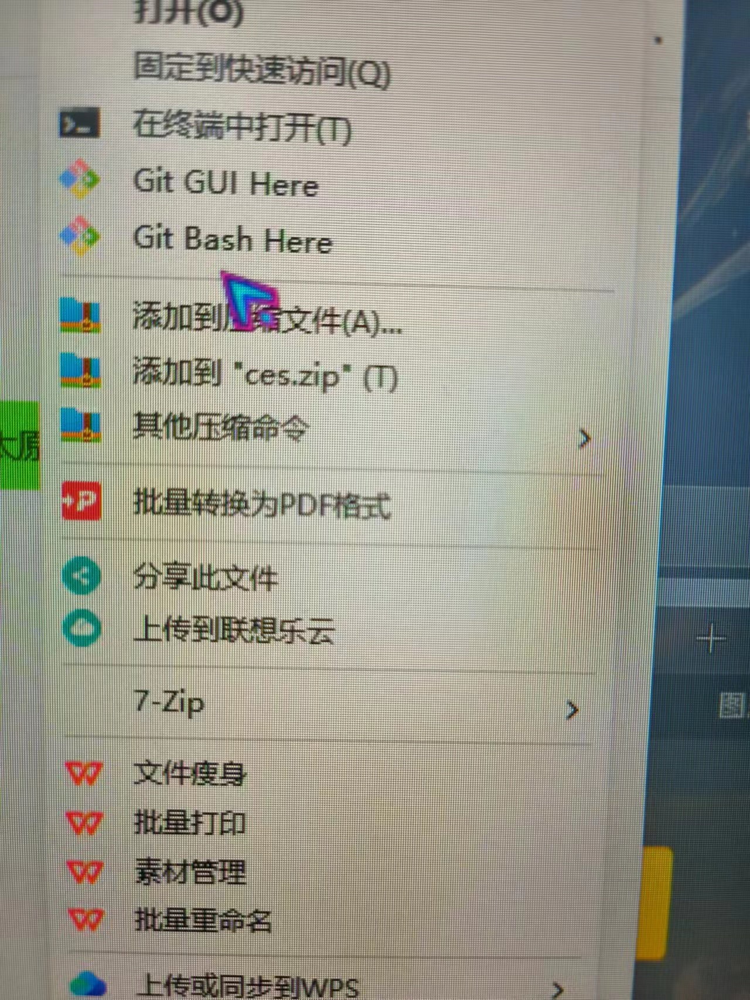
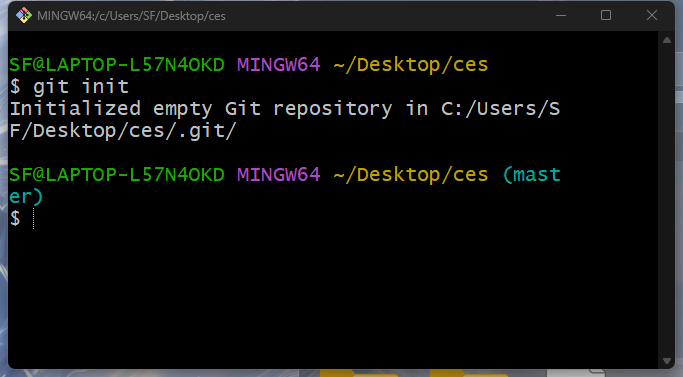
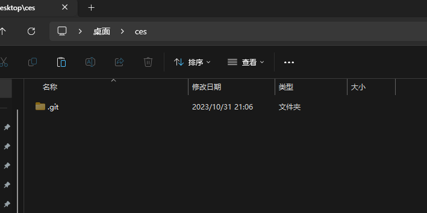
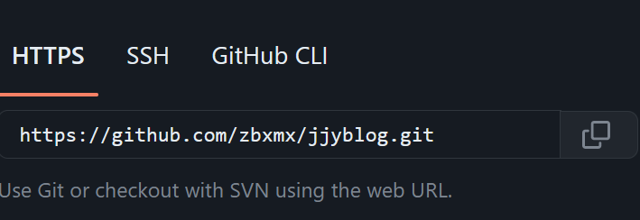
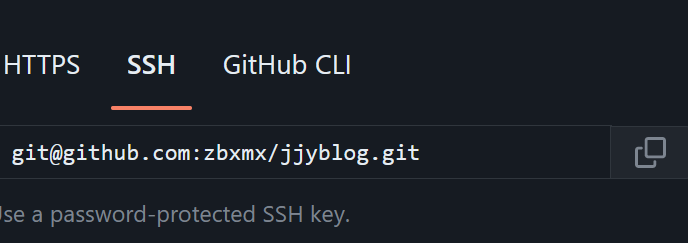

# git的入门学习

* **_git的介绍_**

​        Git（读音为/gɪt/）是一个开源的[分布式](https://baike.baidu.com/item/分布式/19276232?fromModule=lemma_inlink)版本控制系统，可以有效、高速地处理从很小到非常大的项目[版本管理](https://baike.baidu.com/item/版本管理/2511538?fromModule=lemma_inlink)。 [1]也是[Linus Torvalds](https://baike.baidu.com/item/Linus Torvalds/9336769?fromModule=lemma_inlink)为了帮助管理[Linux内核](https://baike.baidu.com/item/Linux内核/10142820?fromModule=lemma_inlink)开发而开发的一个开放源码的[版本控制软件](https://baike.baidu.com/item/版本控制软件/2617766?fromModule=lemma_inlink)。


* ***Git有什么作用？***

Git的使用范围非常广泛，它不仅可以用于软件开发，还可以应用于任何需要版本控制的项目。当团队存在多人协作开发时，Git可以提高开发效率，减少代码冲突[这个是Git作为分布式版本控制系统一个优势之一，可以避免开发环境产生冲突而导致代码丢失的情况]，同时也可以方便项目管理和维护。

* **_git的下载_**

​      windows安装：进入网站https://git-scm.com/下载安装，然后在cmd命令行配置

```she
> git config --global user.name "你自己的想要设置的名字"
> git config --global user.email "你自己的邮箱"
#检查信息是否写入成功
git config --list 
```

（Linux）ubuntu配置：apt-get install git

* ***理论基础***

**Git 记录的是什么？**



如上，如果每个版本中有文件发生变动，Git 会将整个文件复制并保存起来。这种设计看似会多消耗更多的空间，但在分支管理时却是带来了很多的益处和便利。

**三棵树**

你的本地仓库有 Git 维护的三棵“树”组成，这是 Git 的核心框架。这三棵树分别是：**工作区域、暂存区域和 Git 仓库**


工作区域（Working Directory）就是你平时存放项目代码的地方。

暂存区域（Stage）用于临时存放你的改动，事实上它只是一个文件，保存即将提交的文件列表信息。

Git 仓库（Repository）就是安全存放数据的位置，这里边有你提交的所有版本的数据。其中，HEAD 指向最新放入仓库的版本（这第三棵树，确切的说，应该是 Git 仓库中 HEAD 指向的版本）。

Git 的工作流程一般是：

1. 在工作目录中添加、修改文件；
2. 将需要进行版本管理的文件放入暂存区域；
3. 将暂存区域的文件提交到 Git 仓库。

因此，Git 管理的文件有三种状态：已修改（modified）、已暂存（staged）和已提交（committed），依次对应上边的每一个流程。

# git使用教程---实战

* ***git的常用命令***

  ## git init

  > git init 命令用于在目录中创建新的 Git 仓库。 在目录中执行 git init 就可以创建一个 Git 仓库了。 例如我们在当前目录下创建一个名为yytest的项目。

  ```shell
  mkdir yytest//创建文件夹
  cd yytest/
  git init
  ```

  也可以找到文件夹点击右键选择如图git bash here

  

  进入后输入git init

  

  初始化成功后会在文件夹出现.git 文件夹

  

  证明成功

  ## git clone

  > 克隆远程仓库到本地。

  ```shell
  git clone "远程仓库的地址"
  ```

  远程仓库以github为例 当然也有许多其他的 gitee ，gitlab等

  可以使用https

  

  也可以使用ssh

  

  ## git add

  > 将文件添加到本地暂存区。

  ### 指定文件

  ```shell
  git add filename
  ```

  ### 所有文件

  ```shell
  git add .
  ```

  ## git commit

  > 将已添加到暂存区的文件提交到版本库，并添加提交信息。

  ```shell
  git commit -m "你进行那些操作比如 修改，增加"
  ```

  ## git status

  > 用于查看当前工作目录和暂存区的状态。它会显示有关文件的更改和未跟踪文件的信息，让你了解当前代码库的状态。

  ```shell
  git status
  ```

  ## git diff

  > 查看文件的改动内容，包括与上一次提交的差异。

  ```shell
  git diff
  ```

  ## git log

  > 显示提交历史记录，包括每个提交的作者、日期和提交信息。

  ```shell
  git log
  ```

  ## git branch

  > 查看本地分支列表。

  ```shell
  git branch
  ```

  ## git checkout

  > 切换到指定的分支。

  ```shell
  git checkout branchname
  ```

  ## git merge

  > 将指定分支合并到当前分支。

  ```shell
  git merge branchname
  ```

  ## git push

  > 将本地的提交推送到远程仓库。
  >
  > 
  
  ```shell
  git push 
  //如果有提交分支的话
  git push "远程仓库的名字" "分支名字"
  ```

  
  
  ## git pull
  
  > 从远程仓库拉取最新的修改并合并到当前分支。
  
  ```shell
  git pull
  ```

 ##     git remot

 > 从连接远程仓库。

 ```shell
 git remote add "给远程仓库取个名字" "远程仓库的地址可以是https也可以是ssh"
 ```
