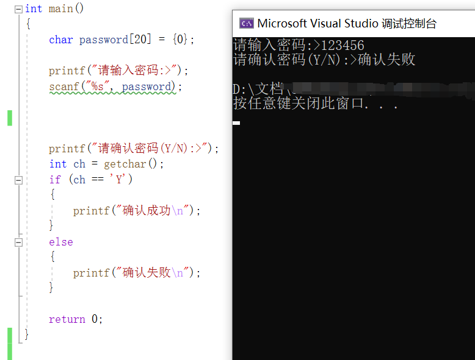
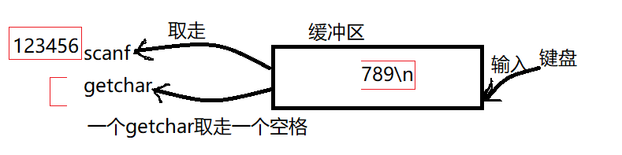
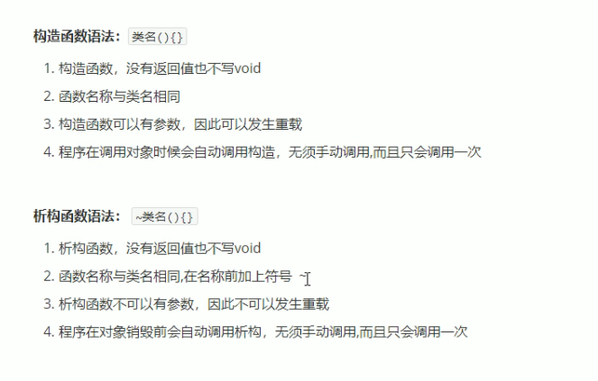
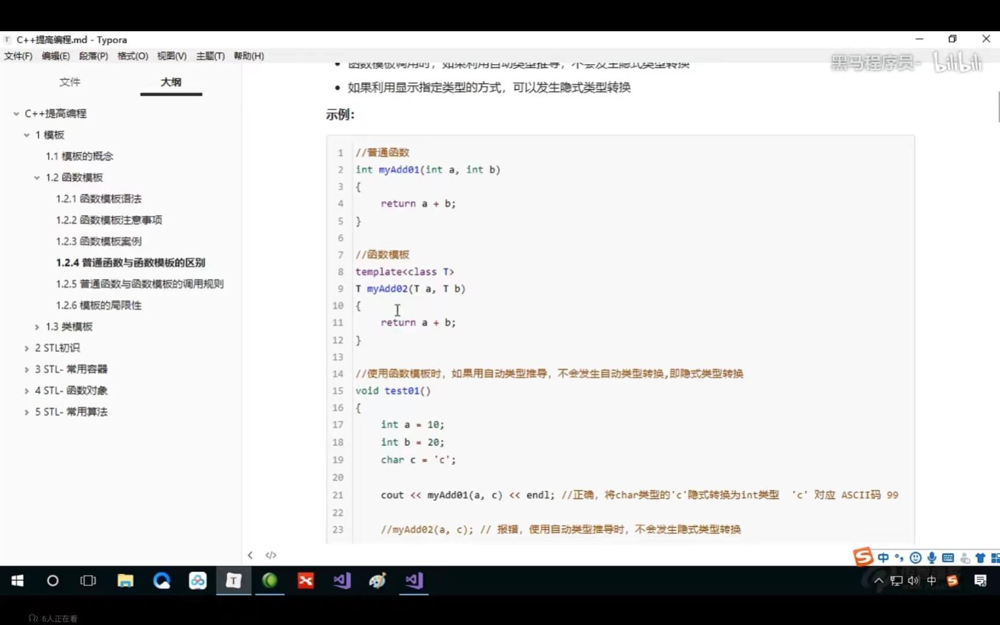
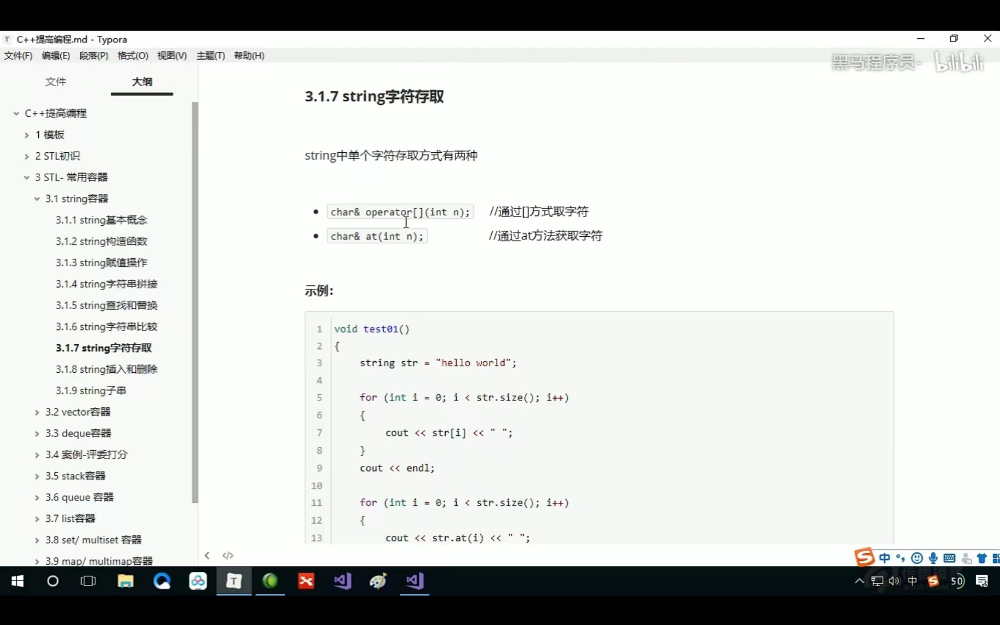

​    

# 笔记

[TOC]


## 1.使用malloc创造二维数组

创造一个p[3] [4]的数组

方法一

```c
int (*p)[4]；
int (*p)[4]=(int(*)[4])malloc(3*4*sizeof(int));
```

方法二

```c
int main()
{
 int** p = (int **)malloc(3*sizeof(int*));//申请指针数组
 
 for(int i=0; i<3; i++)
 {
  p[i] = (int*)malloc(4*sizeof(int));//再申请4个内存空间
 }
 
 for(int i=0; i<3; i++)
 {
  for(int j=0; j<4; j++)
  {
   printf("%p\n", &p[i][j]);//这里根据自己的要求赋值或者打印，赋值和二维数组赋值一样
  }
 }
 for(int i=0; i<3; i++)
 {
  free(p[i]);//记住要释放内存
 }
 free(p);//释放两次，两次释放的不一样
 return 0;
}
```

方法三

```c
int main()
{
 int *p = (int*)malloc(3*4*sizeof(int));//malloc申请12个内存块
 
 for(int i=0; i<3; i++)
 {
  for(int j=0; j<4; j++)
  {
   p[i*4+j] = 1;//注意这里的i*4+j，
   printf("%p\n", &p[i*4+j]); 
  }
 }
 
 free(p);
 
 return 0;
}
```


## 2.sprintf函数

将各种类型的数据转换成字符串

1.格式化数字字符串

把整数123打印成一个字符串保存在s中

```c
sprintf(s,"%d",123);
```

其他类型都一样

2.将整数数组变成字符串

需要两个字符数组，一个字符数组

```c
int a[5]={0,1,2,3,4};
char b[10],c[10];
int i;
for(i=0;i<5;i++){
sprintf(c,"%d",a[i]);
strcat(b,c);
}
```


##  3.gcd函数(最大公约数)

辗转相除法

```c
void gcd()
{
	int a,b,c;
	printf("请输入：");
	scanf("%d%d",&a,&b);
	if(a<b)
	{
		c = a;
		a = b;
		b = c;                      //确保a≥b
	}
	while(b != 0)                   
	{	
		c = b;
		b = a%b;                    //辗转相除：相比第一种思路大大提高了代码的效率
		a = c;
	}
	printf("最大公约数为：%d",a);
	return 0;
}

```

递归思想解法


```c
int gcd(int a,int b)
{
	if(a > b)
	{
		if(a % b == 0)
		{
			return b;
		}
		else
		{
			return gcd(b,a%b);    
		}
	}
	else
	{
		if(b % a == 0)
		{
			return a;
		}
		else
		{
			return gcd(a,b%a);
		}
	}
}
int gcd(int a,int b){|
return b?gcd(b,a%b):a}

```


## 4.c++中vector函数

进行使用前须头文件：   #include  < vector>

### 一.说明

1.可以看做动态数组，封装好的累

2.vector 函数是向量类型，可以容纳多种类型的数据

### 二.初始化

```c
1.
//定义具有10个整型元素的向量（尖括号为元素类型名，它可以是任何合法的数据类型），不具有初值，其值不确定
vector<int>a(10);
2.
//定义具有10个整型元素的向量，且给出的每个元素初值为1
vector<int>a(10,1);
3.
//用向量b给向量a赋值，a的值完全等价于b的值
vector<int>a(b);
4.
//将向量b中从0-2（共三个）的元素赋值给a，a的类型为int型
vector<int>a(b.begin(),b.begin+3);
5.
 //从数组中获得初值
int b[7]={1,2,3,4,5,6,7};
vector<int> a(b,b+7）;
```

### 三，内置函数

```c
#include<vector>
vector<int> a,b;
//b为向量，将b的0-2个元素赋值给向量a
a.assign(b.begin(),b.begin()+3);
//a含有4个值为2的元素
a.assign(4,2);
//返回a的最后一个元素
a.back();
//返回a的第一个元素
a.front();
//返回a的第i元素,当且仅当a存在
a[i];
//清空a中的元素
a.clear();
//判断a是否为空，空则返回true，非空则返回false
a.empty();
//删除a向量的最后一个元素
a.pop_back();
//删除a中第一个（从第0个算起）到第二个元素，也就是说删除的元素从a.begin()+1算起（包括它）一直到a.begin()+3（不包括它）结束
a.erase(a.begin()+1,a.begin()+3);
//在a的最后一个向量后插入一个元素，其值为5
a.push_back(5);
//在a的第一个元素（从第0个算起）位置插入数值5,
a.insert(a.begin()+1,5);
//在a的第一个元素（从第0个算起）位置插入3个数，其值都为5
a.insert(a.begin()+1,3,5);
//b为数组，在a的第一个元素（从第0个元素算起）的位置插入b的第三个元素到第5个元素（不包括b+6）
a.insert(a.begin()+1,b+3,b+6);
//返回a中元素的个数
a.size();
//返回a在内存中总共可以容纳的元素个数
a.capacity();
//将a的现有元素个数调整至10个，多则删，少则补，其值随机
a.resize(10);
//将a的现有元素个数调整至10个，多则删，少则补，其值为2
a.resize(10,2);
//将a的容量扩充至100，
a.reserve(100);
//b为向量，将a中的元素和b中的元素整体交换
a.swap(b);
//b为向量，向量的比较操作还有 != >= > <= <
a==b;
```

## 5.链表

链表的创建

1.

```c
struct ListNode *createlist() {
	struct ListNode *head, *p, *q;
	head = (struct ListNode *)malloc(sizeof(struct ListNode));
	if (head == NULL) {
		return NULL;
	}
	q = head;
	int num;
	scanf("%d", &num);
	while (num ) {
		p = (struct ListNode *)malloc(sizeof(struct ListNode));
		p->data = num;
		q->next = p;
		q = p;
		scanf("%d", &num);


	}
	q->next = NULL;
	return head->next;
}

```

头插法

```c
struct ListNode *createlist()
{
    int num;
    struct ListNode *p=NULL, *head=NULL;
    scanf("%d",&num);
    
    while(num!=-1){
        p = (struct ListNode *)malloc(sizeof(struct ListNode));//指针定义完，别忘记malloc()申请内存空间
        p->data = num;
        p->next=NULL;
        
        /*头插法：尾不动，头动*/
        if(head==NULL){
            head = p;
        }else{
            p->next=head;
            head = p;
        }
        scanf("%d",&num);
    }
    return head;
    
}
```

2.

```c
#include <bits/stdc++.h>
//带头结点

struct node { //创造结点
	int value;
	struct node *next;//指向下一个结构
};

//创建空链表（带头结点的）
struct node *creat_list() {
	struct node *list = (struct node *)malloc(sizeof(struct node));
	if (list == NULL) {
		return NULL;
	}

	list->next = NULL;
	return list;

}

//使用数组来创建一个空链表
struct node *list_creat(int data[], int n) {
	//创建头结点
	struct node *list = (struct node *)malloc(sizeof(struct node));
	if (list == NULL) {
		return NULL;
	}
	struct node *p = list;
	for (int i = 0; i < n; i++) {
		//创建一个新结点
		struct node *tmp = (struct node *)malloc(sizeof(struct node));
		//设置数据
		tmp->value = data[i];
		//链接
		p->next = tmp;
		//指针后移一位
		p = tmp; //p = p->next;
	}
	p->next = NULL;
	return list;


}

void list_visit(struct node *list) {
	if (list == NULL) {
		return;
	}

	for (struct node *p = list->next; p; p = p->next) {
		printf("%d ", p->value);
	}


}

int main() {
	int a[10] = {0, 1, 2, 3, 4, 5, 6, 7, 8, 9};
	struct node *list = list_creat(a, 10);
	list_visit(list);
}


//int main() {
//	struct node a;//是一个结点
//	struct node b;
//	struct node *list = NULL; //空链表
//
//	list = &a; //list链表含有一个结点
//	a.next = &b;
//	b.next = NULL;
//	return 0;
//}
```

链表的删除

```c
//链表的删除删除list包含value的结点
bool list_del(struct node *list, int value) {
	if (list == NULL)
		return false;
	struct node *p;
	for (p = list/*第一个结点*/; p->next; p = p->next) {
		if (p->next->value == value) {
			break;
		}
	}
	//p指向了含有value的结点
	if (p->next == NULL) {
		return false;
	} else {	//此时已经找到了value
		struct node *tmp = p->next; //使用临时指针，指向需要删除的结点

		p->next = tmp->next;

		free(tmp);
		return true;
	}
}
//链表的删除（可以删除多个值相除或大于小于根据条件进行更改）

struct stud_node *deletelist( struct stud_node *head, int min_score ) {
	struct stud_node *p, *q = NULL;
	p = head;
	while (p) {
		if (p->score < min_score) {
			if (q) {
				q->next = p->next;
				free(p);
				p = q->next;
			} else {
				head = p->next;
				free(p);
				p = head;
			}
		} else {
			q = p;
			p = p->next;
		}
	}


```

链表的输出

```c
void list_visit(struct node *list) {
	if (list == NULL) {
		return;
	}

	for (struct node *p = list->next; p; p = p->next) {
		printf("%d ", p->value);
	}


}

```


## 6.scanf被跳过没有执行

在运行scanf函数时，scanf常常会被跳过。这是因为当你进行过了scanf函数后, 在第二次scanf函数时,
由于缓存区里依然存着第一次结束时送入的回车符,在第二次时没有读入就直接把回车符送入了,所以没有真正起到读入数据的作用。这个时候我们清除缓冲区就可以了。

解决方法

1.使用getchar（）

2.scanf前面加rewind([stdin](https://so.csdn.net/so/search?q=stdin&spm=1001.2101.3001.7020));
或者
3.scanf前面 fflush(stdout)

## 7.负整数表示二进制

1.设计符号位为1

2绝对值得二进制取反在加1

二进制变负整数

该负整数的绝对值是其二进制取反在加1

## 8.cin和scanf的知识点


cin.get()返回值是int


## 9.freopen


## 10.按位异^


## 11.++在前先加后用，++在后先用后加

## 12.getchar

### 1.getchar的初步运用 

返回值是int

getchar在读取结束或者失败时返回EOF

getchar返回的值是该字符的ascll值

getchar的while运用

切记使用while是必须要（）在ch=getchar；

1.

```c
int ch;
while((ch=getchar())!=EOF)//EOF是-1；
{putchar(ch);//输出是字符
//也可以进行其他编写但要记住此时的ch是int\
//比如下面的是可以使用的
if(ch=='c')


}
```

2.

```c
char ch;
while((ch=getchar())！='\n'){
if(ch=='c');
}

```

### 2.getchar 的问题解决

```c
#include<stdio.h>
int main()
{
	char password[20] = {0};
	printf("请输入密码:>");
	scanf("%s", password);

printf("请确认密码(Y/N):>");
int ch = getchar();
if (ch == 'Y')
{
	printf("确认成功\n");
}
else
{
	printf("确认失败\n");
}

return 0;
```

}

按理说，我们是想要输入密码，然后再输入N或者Y，根据我们输入的是N还是Y打印“确认成功”或“确认失败”。
我们来运行一下，看看是否是这样

可以看到，我们还没有输入Y或N，他就立马跳出来了一个“确认失败”
为什么会是这样呢？

（1）原理详解
我们来看看它其中的原理：
scanf和getchar都是输入函数，它们都是从键盘上来读取我们的数据，但它们不是直接从键盘上来读取我们的数据。它们和键盘之间有一个区域叫缓冲区。
输入函数先来看缓冲区中是否有数据，如果有，它直接就拿走了，不需要从键盘输入，如果缓冲区什么都没有，则需要从键盘输入，再拿走。

明白这个道理后，我们回到上面那串代码。
最开始缓冲区里没有东西，所以我们这行代码

scanf("%s", password);

就是从键盘输入密码，我们输入123456。为了让123456放进去，我们还敲了一个回车，所以缓冲区里为

123456\n


接下来就是scanf来读缓冲区里的字符串了，scanf读取的方式是读取\n之前的内容，所以读取的是123456.
printf("请确认密码(Y/N):>");后，就是下面这行代码：

int ch = getchar();

getchar用来接收字符，


getchar看到缓冲区中有数据（\n）,直接取走，不需要从键盘输入。自然也就出现了我们上面运行结果的那一幕：还没输入N或Y，就立马跳出“确认失败”了。

（2）解决措施
那么我们怎么解决这个问题呢？
很自然就能想到需要先把缓冲区里清空。
那我们就在前面加一个getchar把缓冲区中的“\n”给清理掉。
即代码变为

```c
#include<stdio.h>
int main()
{
	char password[20] = {0};
	printf("请输入密码:>");
	scanf("%s", password);
	getchar();//把缓冲区中的\n清理掉

printf("请确认密码(Y/N):>");
int ch = getchar();
if (ch == 'Y')
{
	printf("确认成功\n");
}
else
{
	printf("确认失败\n");
}
return 0;}
```


运行一下即可发现，现在能够得到我们的理想结果。


2、输入的密码中有空格
不过又有一个问题，当我们输入密码为123456 789时（中间有一个空格），还没等我们输入N或Y，又立马跳出了“确认失败”。

（1）原理详解
首先缓冲区里没有东西，我们需要通过键盘输入密码123456 789，


然后scanf就来取缓冲区中的数据，当它读到空格的时候，它就不再读了（这是scanf的一个作用性质）。
所以scanf就只取走了123456，而缓冲区中还剩下（空格） 789\n。


再往下，运行到getchar();这行代码，然而这里只有一个getchar，它只能读取一个字符，也就是只读了空格，缓冲区中还剩789\n。

再往下，就是我们的这行代码int ch = getchar();



getchar（)一来就取走了缓冲区中的7，根本不需要我们从键盘输入N或Y。运行时自然它就自动跳出了“确认错误”。

（2）解决措施
所以我们需要把缓冲区中的东西先全部清走。
那我们就用一个循环，只要没读到\n，我们就一直用getchar读。
即

//把缓冲区中的内容全读走
	while ( getchar() != '\n')
	{
		;
	}

整段代码如下：

```c
#include<stdio.h>
int main()
{
	char password[20] = {0};
printf("请输入密码:>");
scanf("%s", password);

//把缓冲区中的内容全读走
while ( getchar() != '\n')
{
	;
}
printf("请确认密码(Y/N):>");
int ch = getchar();
if (ch == 'Y')
{
	printf("确认成功\n");
}
else
{
	printf("确认失败\n");
}

return 0;}
```

运行一下

是我们想要的效果。


## 13.getchar和scanf的区别

scanf遇到空格，回车和Tab键都会停止他不会读入空格

getchar遇到回车截止

getchar()是在输入缓冲区顺序读入一个字符(包括空格、回车和Tab)getchar()使用不方便,解决方法： 

（1）使用下面的语句清除回车：while(getchar()!=’\n’); 用这个不会读入回车

（2）用getche()或getch()代替getchar()，其作用是从键盘读入一个字符（不用按回车），注意要包含头文件<conio.h>

## 14 大于longlongint的数

### 1.如果只考虑正数

可以使用unsigned long long

具体数:0~18446744073709551615

10*20次

long long

9223372036854775807

10*19次

### 2 使用数组

### 3.__int128

__int128 就是占用128字节的整数存储类型。由于是二进制，范围就是 -2^127~2^127-1，如果使用了 unsigned __int128，则范围变成 00 ~ 21282128，即约39位数,这在一定程度上可以替代高精度运算实现大数运算，而且操作难度更低，所以在数据范围不超过的情况下，都可以使__int128。
由于_int128只能实现[四则运算](https://so.csdn.net/so/search?q=四则运算&spm=1001.2101.3001.7020)，不能用cin,cout,scanf,printf输入输出，我们首先应该写个快读和快写的函数；

输入或快读

快读

```c
__int128 read()
{
	//直接在函数里面实现读字符串操作更简洁
	__int128 res=0;//初始结果赋值0
	char scan[1005];
	scanf("%s",scan);
	for(int i=0;i<strlen(scan);i++)
		res*=10,res+=scan[i]-'0';//实现进位
	return res;//返回__int128类型
}
```

输入

```c
__int128 read()
{
    __int128 f=1,w=0;
    char ch=getchar();
    while(ch<'0'||ch>'9')
    {
        if(ch=='-')
        f=-1;
        ch=getchar();
    }
    while(ch<='9'&&ch>='0')
    {
        w=w*10+ch-'0';
        ch=getchar();
    }
    return f*w;
}
```

输出或快写

快写

```c++
void print(__int128 num)
{//递归调用，实现从高位向低位输出
	if(num>9) 
		print(num/10);
	putchar(num%10+'0');
}
```

输出

```c
void print(__int128 x)
{
    if(x<0)
    {
        putchar('-');
        x=-x;
    }
    if(x>9)print(x/10);
    putchar(x%10+'0');
}
```

使用

```c
#include <bits/stdc++.h>

using namespace std;

typedef unsigned __int128 LLL;

__int128 read() {
	//直接在函数里面实现读字符串操作更简洁
	__int128 res = 0; //初始结果赋值0
	char scan[1005];
	scanf("%s", scan);
	for (int i = 0; i < strlen(scan); i++)
		res *= 10, res += scan[i] - '0'; //实现进位
	return res;//返回__int128类型
}

void print(__int128 num) {
	//递归调用，实现从高位向低位输出
	if (num > 9)
		print(num / 10);
	putchar(num % 10 + '0');
}

int main() {
	LLL a, b;
	a = read(), b = read();
	print(a + b);
	return 0;
}

```

## 15.const

const int *p;

指针指向的方向可以改，指针指向的值不可以改

int *const p

指针的指针方向不可以改，指向的值可以改

## 16.srand/rand

## 17. new

```c++
#include<iostream>
using namespace std;
//new的基本语法
int* func() {
	//堆区创建整形数据
	//new返回是 该数据类型的指针
	int *p=new int(10);
	return p;
}
void test01() {
	int* p = func();
	cout << *p << endl;
	cout << *p << endl;
	//使用delete关键字释放堆区数据
	delete p;
	//cout << *p << endl;此处已被释放无法使用
}
void test02() {
	
		//创建10整形数据的数组，在堆区
		int* arr = new int[10];
	for (int i = 0; i < 10; i++) {
		arr[i] = i + 100;
	}
	for (int i = 0; i < 10; i++) {
		cout << arr[i] << endl;
}
	//释放堆区数组
	//释放数组使用delete必须加[]
	delete[] arr;

}
int main() {
	test01();
	test02();
	
}
```

## 18.引用


```c++
#include<iostream>
#include<stdio.h>

using namespace std;
int main() {
	int a = 10;
	//1.引用必须初始化
	//int &b;//错误必须初始化
	int& b = a;
	//2.引用在初始化后，不可以改变
	int c = 20;
	//&b = c;//这是错误的不能在更改
	b = c;//这是赋值操作，不是更改引用
	cout << a << endl;
	cout << b << endl;
	cout << c << endl;
}

```

###  引用做函数参数

```c++
#include<iostream>
#include<stdio.h>
using namespace std;
//1.值传递
//2.地址传递（指针）
//3.引用传递和地址传递的效果一样
void swap(int& a, int& b) {
	int temp = a;
	a = b;
	b = temp;
}
int main() {
	int a = 10;
	int b = 20;
	swap(a, b);
	cout << a << endl;
	cout << b << endl;

}

```

### 引用做函数返回值

```c++
#include<iostream>
#include<stdio.h>
using namespace std;
//引用做函数返回值
//1.不要返回局部变量的引用
int& test() {
	int a=10;//局部变量存放在四区的栈区
	return a;//在执行完会被释放出错
}
//2.函数的调用可以作为左值
int& test01() {
	static int a = 100;//静态变量，存放在全局区，全局区的数据在程序结束后系统释放
   return a;
}
int main() {
	int& ref = test();
	cout << ref << endl;
	cout << ref << endl;
	int& p = test01();
	cout << p << endl;
	test01() = 1000;//左值相当于a为100，p是别名
	cout << p << endl;

}

```

### 引用的本质就是在c++内部就是一个指针常量

```c++
#include<iostream>
#include<stdio.h>
using namespace std;
//发现引用，转换为int *const ref=&a
void func(int& ref)
{
	ref = 100;//ref是引用，转换*ref=100
}
int main() {
	int a = 100;
	//自动转换int*const ref=&a;指针常量是指针指向不可改，也说明为什么引用不可以更改
	int& ref = a;
	ref = 20;//内部发现ref是引用，自动转换为*ref=20
	cout << "a=" << a << endl;
	cout << "ref=" << ref << endl;
	func(a);
	cout << "a=" << a << endl;
	cout << "ref=" << ref << endl;
	
}
```

### 常量的引用

```c++
#include<iostream>
#include<stdio.h>
using namespace std;
void showvalue( const int& val) {
	//防止修改
	cout << "value=" << val << endl;
}
//常量引用
int main() {
	//使用场景：用来修饰形参，防止误操作
	//int a=10;
	 //int& ref = 10;这是错误的，引用必须引一块合法空间
	const int& ref = 10;//加上const，编译器将代码修改为，int temp=10；const int& ref=temp;
	//ref = 20;//加入const变为只读不可修改
	int a = 100;
    showvalue(a);
	a = 1000;
	showvalue(a);
	cout << "a=" << a;


}
```

## 19.函数

### 默认参数

```c++
#include<iostream>
#include<stdio.h>
using namespace std;
//函数默认值
//如果我们自己传入数据，就用自己的数据，如果没有，那么就用默认值
//语法：返回值类型 函数名（形参=默认值
int func( int a,int b=20,int c=30) {
	
	return a + b + c;

}
//注意事项
//1.如果某个位置已经有了默认参数，那么从这个位置以后，从左到右必须有默认值
//int fun2(int a,int b=20,int c)这是错误的
//2.如果函数声明有默认参数，函数实现就不能有默认参数
int func2(int a = 10, int b = 20);
int func2(int a, int b) {//此时如果a，b有默认值会出错

	return a + b;
}
int main() {
	cout << func(10) << endl;
		
}
```

### 占位参数

```c++
#include<iostream>
#include<stdio.h>
using namespace std;
//占位参数
//返回值类型 函数名（数据类型）
//占位参数 还可以有默认参数
void func(int a,int) {//后面的int就是占位的
	cout << "this is func" << endl;
}
int main() {
	func(10,10);
		
}
```

### 函数重载

```c++
#include<iostream>
#include<stdio.h>
using namespace std;
//函数重载 
// 可以让函数名相同，提高复用性
//满足条件
// 1.同一作用域下
//2.函数名称相同
//3.函数参数类型不同，或者个数不同，或者顺序不同；

void func() {
	cout << "func的调用" << endl;
}
void func(int a) {
	cout << "func(int a)的调用" << endl;
}
void func(double a) {
	cout << "func(double a)的调用" << endl;
}
//注意“函数的返回值是不可以作为函数重载的条件
int main() {
    func();
	func(10);
	func(10.1);
}
```

注意事项

```c++
#include<iostream>
#include<stdio.h>
using namespace std;
//函数重载的注意事项
//1.引用作为重载的条件
void func(int& a) {
	cout << "func(int &a)的调用" << endl;
}
void func(const int& a) {
	cout << "func(const int& a)的调用" << endl;
}

//2.函数重载碰到默认参数
void func2(int a, int b=10) {
	cout << "func2(int a,int b)的调用" << endl;
}
void func2(int a) {
	cout << "func2(int a)的调用" << endl;
}

int main() {
   
	int a = 10;
	func(a);//这个调用的不待const
	func(10);//这个是带const
	func2(10);//当函数重载碰到默认参数 出现二义性报错
}
```

## 20类和对象

c++面向对象的三大特性：封装，继承，多态

### 封装

意义

1.将属性和行为作为一个整体，表现生活中的事物

2.将属性和行为加以权限控制

在设计类的时候，属性和行为写在一起，表现事物

语法 class 类名{访问权限：属性/行为}；

案例1 设计一个圆

```c++
#include<iostream>
#include<stdio.h>
using namespace std;
//设计一个圆类，求周长
//公式：2*pi*半径
const double pi = 3.14;
//class 代表要设计一个类，后面就是类的名称
class circle
{//访问权限
public:

 //属性
	int r;//半径
	//行为
	//获取周长
	double zc() {
		return 2 * pi * r;
	}
};

int main() {
 //通过圆类 创建具体的圆（对象）
	circle c1;
// 给圆对象 的属性赋值
	c1.r = 10;
	cout << "圆的周长：" << c1.zc() << endl;


}
```

案例2 设计一个学生

```c++
#include<iostream>
#include<string>
using namespace std;
//设计一个学生类，属性有姓名和学号
//可以给学生姓名和学号赋值，并且显示
class student{
public://公共权限
	//类中的属性和行为 我们统一称为成员
	//属性 成员属性 成员变量
	//行为 成员函数 成员方法
	// 
	
	//属性
	string name;
	int num;
	void showstudent() {
		cout << "姓名：" << name << "学号：" << num << endl;

	}
	//给姓名赋值
	void setname(string Name) {
		name = Name;
	}
};
int main() {
	student c1;
	cin >> c1.name >> c1.num;
	c1.showstudent();

}
```

封装意义二

类在设计时，可以把属性和行为放在不同的权限下，加以控制

访问权限有三种

1.public 公共权限

2.proctected 保护权限

3.private  私有权限

```c++
#include<iostream>
#include<string>
using namespace std;
//访问权限
//3种
//公共权限 public 成员类内可以访问 类外也可以
//保护权限 protected  成员 类内可以访问 类外不可以 儿子可以访问父亲 只有当前类的成员与继承该类的类才能访问
//私有权限 private   成员 类内可以 类外不可以  儿子不可以访问
class person
{
public:
	string name;
protected:
	string car;
private:
	int password;
public:
	void func(){
		name = "张三";
	    car = "拖拉机";
		password = 123456;
	}
};
int main() {
	person p1;
	p1.name = "李四";
	//p1.car = "宝马";//不可访问
	//p1.password = 123;//不可访问
}
```

### struct和class的区别

在c++中struct和class区别在于默认的访问权限不同

区别

1.struct 默认权限为公共

2.class 默认权限为私有

```c++
#include<iostream>
using namespace std;
class c1
{
	int ma;//私有
};
struct c2
{
	int mb;//公共
};
int main() {
	c1 a;
	//a.ma = 100;这是错误的
	c2 b;
	b.mb = 100;
}
```

### 将成员属性设为私有

优点1 可以自己控制读写权限

   2 对于读写权限，我们可以检测数据的有效性


```c++
#include<iostream>
#include<string>
using namespace std;
class person
{
public:
	//写姓名
	void setname(string a) {
		name = a;
   }
	//获取姓名
	string getname() {
		return name;
	}
	//获取年龄
	int getage() {
		age = 0;
		return age;
	}
	//情人只写
	void setlover(string a) {
		love = a;
	}

private:
	//姓名  可读可写
	string name;
	//年龄  只读
	int age=0;
	//老婆  只写
	string love;
};

int main() {
	person p;
	p.setname("张山");
	cout << "姓名为：" << p.getname() << endl;
	cout << "年龄为：" << p.getage() << endl;
	p.setlover("苍劲");
}
```

立方体类 案例

```c++
#include<iostream>
#include<string>
using namespace std;
//立方体类设计
//1.创建一个类
// 2.设计属性
// 3.设计行为
//4.分别利用全局函数和成员函数 判断两个立方体是否相等
class cube {
public:
	void setl(int al) {
		l = al;
	}
	int getl() {
		return l;
	}
	void seth(int ah) {
		h= ah;

	}
	int geth() {
		return h;
	}
	void setw(int aw) {
		w= aw;
	}
	int getw() {
		return w;
	}
	int s(){
		return (l*h+w*h+w*l)*2;
}
	int v() {
		return h* w* l;
	}
	bool same(cube& c2) {
		if (l == c2.getl() && h == c2.geth() && w == c2.getw())
			return true;
		else
			return false;
	}
private:
	int h;
	int w;
	int l;
};
bool issame(cube& c1, cube& c2) {
	if (c1.getl() == c2.getl() && c1.geth() == c2.geth() && c1.getw() == c2.getw())
		return true;
	else
		return false;
}
int main() {
	cube c1,c2;
	c1.seth(10);
	c1.setl(10);
	c1.setw(10);
	cout << "面积为：" << c1.s ()<< endl;
	cout << "体积为：" << c1.v() << endl;
	c2.seth(10);
	c2.setl(10);
	c2.setw(10);
	cout << "面积为：" << c2.s() << endl;
	cout << "体积为：" << c2.v() << endl;
	bool ret= issame(c1, c2);
	if (ret) {
		cout << "==";

	}
	else {
		cout << "!=";
	}
	bool et = c1.same(c2);
	if (et) {
		cout << "==";

	}
	else {
		cout << "!=";
	}
}
```

### 对象的初始化与清理

#### 构造函数和析构函数




```c++
using namespace std;
//对象的初始化和清理
//1.构造函数 进行初始化
class person {
public:
	// 构造函数
	//没有返回值 不用写void
	// 函数名与类名相同
	// 构造函数可以有参数，可以发生重载
	//创建对象的时候，构造函数会自动调用，而且只调用一次
	person() {
		cout << "person 构造函数的调用" << endl;
	}
	// 析构函数
	//没有返回值 不写void
	//函数名和类相同 在名称前加~
	//析构函数不可以有参数 不可以重载
	//对象在销毁前会自动调用析构，只调用一次
	~person(){
		cout << "persond的析构函数调用" << endl;

	}
};
void test01() {
	person p;//在栈上的数据，test01执行完毕，释放这个对象
}
int main() {
	//test01();
	person p;
	system("pause");
}
```

#### 构造函数的分类以及调用

​        1.两种分类方式

- 按参数分为：有参构造和无参构造

- 按类型分为：普通构造和拷贝构造
  2.三中调用方式

- 括号法

- 显示法

- 隐式转换法

  ```c++
  #include<iostream>
  #include<iomanip>
  using namespace std;
  //1.构造函数分类以及调用
  //分类
  //按照参数 有参和无参 (默认构造
  //按照类型分类 普通构造 和拷贝构造
  class person {
  public:
  	//构造函数
  	person() {
  		cout << "person的无参构造函数的调用" << endl;
  
  	}
  	person(int a) {
  		cout << "person的有参构造函数的调用" << endl;
  		age = a;
  	}
  	//拷贝构造函数
  	person(const person& p){
  		//将传入的人身上的所有属性，拷贝到我身上
  		age = p.age;
  		cout << "person的拷贝构造函数调用" << endl;
  	}
  	~person() {
  		
  			cout << "person的析构函数调用" << endl;
  	}
  	int age;
  };
  //调用
  void test01() {
  	//1.括号法
  	//person p;//默认构造函数的调用
  	//person p2(10);//有参的调用
  	//person p3(p2);//拷贝构造函数
  	//cout << p2.age << endl;
  	//cout << p3.age << endl;
  	//注意事项
  	//调用默认构造函数，不要加（）
       //因为下面这行代码编译器会认为是一个函数的声明
  
  	/*person p1（）;*/
  	//2.显示法
  	person p1;
  	person p4 = person(10);//有参构造
  	person p5 = person(p4);//拷贝构造
  	person(10);//匿名对象 特点：当前行执行结束后，系统会立即回收匿名对象
  	cout << "aaaaa" << endl;
  	//注意事项
  	// 不要利用拷贝构造函数 初始化匿名对象 编译器会认为person(p5)===person p5:
  	//person(p5);会出现重定义
  	//3.隐式转换法
  	person p6 = 10;//相当于写了person（p6）=perosn（10） 有参构造
  	person p7 = p4;//拷贝构造
  
  }
  int main()
  {
  	test01();
  
  }
  ```

#### 析构函数的调用时机

三种情况

  1.使用一个已经创建完毕的对象来初始化一个新对象

  2.值传递的方式给函数参数传值

  3.以值方式返回局部函数

  ```c++
#include<iostream>
#include<iomanip>
using namespace std;
class person {
public:
	person() {
		cout << "无参构造函数" << endl;
		mage = 0;
	}
	person(int age) {
		cout << "有参构造函数" << endl;
		mage = age;
	}
	person(const person& p) {
		mage = p.mage;
		cout << "拷贝构造函数" << endl;
	}
	
	int mage;
	~person() {
		cout << "析构函数的额调用" << endl;
	}
};
//1.使用一个已经创建完毕的对象来初始化一个新对象
void test01() {
	person p1(20);
	person p2(p1);
	cout << "p2=" << p2.mage << endl;
}
//2.值传递的方式给函数参数传值(不会影响其他
void dowork(person p) {

}
void test02() {
	person p;
	dowork(p);
}
//3值方式返回局部对象
person dowork2() {
	person p1;
	cout << &p1 << endl;
	return p1;
}
void test03() {

	person p = dowork2();
	cout << &p << endl;
}
int main()
{
	//test01();
	//test02();
	test03();
}
  ```

  #### 析构函数的调用规则

1.默认构造函数（无参，函数体为空

2.默认析构函数（wuc，函数体为空

3.默认拷贝构造函数，对属性进行值拷贝

构造函数调用规则如下

如果用户定义有参构造函数，c++不会在提供默认无参构造，但会提供默认拷贝构造

如果用户定义拷贝构造函数     c++不会提供其他构造函数

```c++
#include<iostream>
using namespace std;
//如果我们写了有参构造函数 编译器就不再提供默认构造 依然提供拷贝构造
//如果我们写了拷贝构造函数，编译器就不再提供其他普通构造函数了
class person {
public:
	person() {
		cout << "无参构造函数" << endl;
	}
	~person() {
		cout << "析构函数" << endl;
	}
	person(int a) {
		cout << "有参构造函数" << endl;
		age = a;
	}
	person(const person& p) {
		cout << "拷贝构造函数" << endl;
		age = p.age;
	}
	int age;
};
void test01() {
	person p;
	p.age = 18;
	person p2(p);
	cout << p2.age << endl;

}
int main() {
	test01();
}
```


#### 深拷贝与浅拷贝

浅拷贝：简单的赋值拷贝操作

深拷贝：在堆区重新申请空间，进行拷贝操作

```c++
#include<iostream>
using namespace std;

class person {
public:
	person() {
		cout << "无参构造函数" << endl;
	}
	~person() {
		//析构函数，将堆区开辟的数据做释放操作
		if (height != NULL) {
			delete height;
			height = NULL;
		}
		cout << "析构函数" << endl;
	}
	person(int a,int heighte) {
		cout << "有参构造函数" << endl;
		age = a;
		height = new int(heighte);
	}
	//自己实现拷贝构造函数 解决浅拷贝带来的问题 
	person(const person& p) {
		cout << "拷贝构造函数" << endl;
		age = p.age;
		//height=p.height编译器默认实现的就是这行代码
		//深拷贝操作
		height = new int(*p.height);
	}

	int age;
	int* height;
};

void test01() {
	person p1(18,180);
	cout << p1.age << " " << *p1.height << endl;
	person p2(p1);
	cout << p2.age << " " << *p2.height << endl;
}

int main() {
	test01();
}
```

#### 初始化列表

作用：

语法：构造函数（）：属性1（值1），属性2（值2）...{}

```c++
 #include<iostream>
using namespace std;

class person {
public:
	///传统方式的初始化 
	//person(int ma, int mb, int mc) {
		//a = ma;
		//b = mb;
		//c = mc;
	//}
	//person() : a(10), b(20), c(20) {

	//}
	person(int ma, int mb,int mc) :a(ma), b(mb), c(mc) {

	}
	int a;
	int b;
	int c;

};

void test01() {
	person p(10, 20, 50);
	//person p;
	cout << "a=" << p.a << endl;
	cout << "b=" << p.b << endl;
	cout << "c=" << p.c << endl;
}

int main() {
	test01();
}
```

#### 类对象作为类成员

 c++类中的成员可以是另一个类的对象，我们称该成员为对象成员

​        

```c++
class A()
class B{
A a;}
```

   B类中有对象A作为成员，A为对象成员

那么当创建B对象时，A与B的构造和析构的顺序是谁先谁后？

当其他类对象作为本类成员，构造时候先构造其他类对象，在构造自身，析构则相反

```c++
 #include<iostream>
#include<string>
using namespace std;
class phone {
public:
	phone(string pname) {
		name = pname;
		cout << "1";
	}
	string name;
};
class person {
public:
	person(string sname, string pname):name(sname), mphone(pname)  
	{
		cout << "2";

	}
	//姓名
	string name;
	//手机
	phone mphone;

};

void test01() {
	person p("zs", "oppo");
	
	cout << "a=" << p.name << endl;
	cout << "b=" << p.mphone.name  << endl;
	
}

int main() {
	test01();
}
```

#### 静态成员

静态成员就是在成员变量和成员函数加上static

静态成员分为

静态成员变量

1.所有对象共享同一份数据

2.在编译阶段分配内存

3.类内声明，类外初始化

静态成员函数

1.所有对象共享同一个函数

2.静态成员函数只访问静态成员变量

//静态成员变量

```c++
 #include<iostream>
#include<string>
using namespace std;
class person {
public:
	static int a;
	
private:
	static int b;
	

};
void test01(){
	person p;
	cout << p.a << endl;
	person p2;
	p2.a = 200;
	cout << p.a << endl;
}
//静态成员变量两种访问方式
void test02() {
	//通过对象访问
	person p;
	cout << p.a << endl;
	//通过类名访问
	cout<<person::a;

}
int person::b = 200;
int person::a = 100;
int main() {
	//test01();
	test02();
	c
}
```

静态成员函数

```c++
 #include<iostream>
#include<string>
using namespace std;
//静态成员函数
//所有对象共享同一个函数
//静态成员函数只能访问静态成员变量
class person {
public:
	
	static void func( ) {
		a = 100;//静态成员函数可以访问 静态成员变量
		//b = 200;//静态成员函数 不可以访问 非静态成员变量
		cout << "func 函数的调用" << endl;
		
	}

	static int a;
	int b;

};
int person::a = 0;

//静态成员函数两种访问方式
void test02() {
	//通过对象访问
	person p;
	p.func();
	//通过类名访问
	person::func();

}


int main() {
	//test01();
	
	test02();
	
}
```

### c++对象模型和this指针

#### 成员变量和成员函数的分开存储

在c++中 类内的成员变量和成员函数分开存储

只有非静态成员变量才属于类的对象上

```c++
 #include<iostream>
#include<string>
using namespace std;
class person {
	int a;//属于类的对象 非静态成员
	static int b;///不属于对象
};
void test01() {
	person p;
	//空对象占用内存空间为：1
	//c++编译器会给每个空对象分配一个字节空间，是为了区分空间对象占内存的位置
	//每个空对象也应该有一个独一无二的地址
		cout << "p的空间" << sizeof(p) << endl;
}
void test02() {
	person p;
	cout << "p的空间" << sizeof(p) << endl;
}

int main() {
	test01();
	test02();
	
}
```

#### this指针


```c++
 #include<iostream>
#include<string>
using namespace std;
class person {
public:
	person(int age) {
		//this指向被调用的成员函数所属对象
		this->age = age;//age=age会报错
	}
	void personaddage(person& p) {
		this->age += p.age;
	}
	person& personaddager(person& p) {
		//this指向p2的指针，而*this指向p2这个本体
		this->age += p.age;
		return *this;
	}
	int age;
};
//1.解决名称冲突
void test01() {
	person p(18);
	
		cout << "p年龄" << p.age << endl;
}
//2.返回对象本身用*this
void test02() {
	person p1(10);
	person p2(10);
	p2.personaddage(p1);
	p2.personaddager(p1).personaddager(p1);
	cout << "p2的年龄" << p2.age << endl;
}

int main() {
	test01();
	test02();
	
}
```

#### 空指针访问成员函数

c++中空指针也可以调用成员函数的，但是也要注意有没有用到this指针

如果用到this指针，需要加以判断保证代码的健壮性

```c++
#include<iostream>
#include<string>
using namespace std;
class person {
public:
	void showname() {
		cout << "this is a person class" << endl;

	}
	void showage() {
		//报错的原因是因为传入的指针为空
		//修改后
		if(this==NULL){
			return;
		}
		cout << "age=" << age << endl;
	}


	int age;

};
void test01() {
	person* p;
	p = NULL;
	p->showage();
	p->showname();
}
int main() {
	test01();


}
```

#### const修饰成员函数

常函数

成员函数后加const后我们称这个函数为常函数

常函数内不可以修改成员属性

成员属性声明时加关键字mutable后，在常函数中依然可以修改

常对象

声明对象前加从const称这个对象为常对象

常对象只能调用常函数

```c++
#include<iostream>
#include<string>
using namespace std;
//常函数
class person {
public:
	//this指针的本质 是指针常量 指针的指向不可修改
	//const person *const this；
	//在成员函数后面加上const，修饰的是this指针 让指针指向的值不可修改
	void showperson() const{
		this->b;
		//this->a = 100;
		//this=NULL;this指针不可以修改方向

	}
	void func(){

	}

	int a;
	mutable int b;//特殊变量。即使在常函数中，也可以修改这个值

};

void test01() {
	person* p;
	p->showperson();
	
}
//常对象
void test02() {
	const person p;//在对象前加const 变为常对象
	p.b = 100;//b是特殊的
	//常对象只能调用常函数
	p.showperson();
	//p.func();//常对象 不可以调用普通的成员函数 因为普通函数可以修改属性
}
int main() {
	test01();


}
```

#### 友元


##### 全局函数做友元

```c++
#include<iostream>
#include<string>
using namespace std;
class budding {
	//goodgay是budding是好朋友，可以访问
	friend void goodgay(budding* budinging);
public:
	budding() {
		sittingroom = "客厅";
		bedroom = "卧室";
		
	}
	string sittingroom;//客厅
private:
	string bedroom;//卧室

	

};
//全局函数
void goodgay(budding *budinging) {
	cout << "好基友的全局函数 正在访问" << budinging->sittingroom << endl;
	cout << "好基友的全局函数 正在访问" << budinging->bedroom << endl;
}
void test01() {
	budding buding;
	goodgay(&buding);
}
int main() {
	test01();


}
```

##### 类做友元

```c++
#include<iostream>
#include<string>
using namespace std;
class budding {
	//goodgay类是本类的好朋友可以访问私有
	friend class goodgay;
public:
	budding();
	string sittingroom;//客厅
private:
	string bedroom;//卧室

	

};
class goodgay {
public:
	goodgay();
	void visit();//参观函数 访问buddling中的属性
	budding* building;

};
//类外实现成员函数
budding::budding() {
	sittingroom = "客厅";
		bedroom = "卧室";
}
goodgay::goodgay() {
	//创建一个建筑物
	building = new budding;
}


void goodgay::visit() {
	cout << "正在访问" << building->sittingroom << endl;
	cout << "访问" << building->bedroom << endl;
}
void test01() {
	goodgay gg;
	gg.visit();
}
int main() {
	test01();


}
```

##### 成员函数做友元

```c++
#include<iostream>
#include<string>
using namespace std;
class budding;
class goodgay {
public:
	goodgay();
	void visit();//可以访问budding里的

	void visit2();//不可以访问
	budding* building;
};
class budding {
	//告诉编译器 goodgay类下的visit成员函数作为本类的好朋友 可以访问私有
	friend void goodgay::visit();
public:
	budding();

	string sittingroom;//客厅
private:
	string bedroom;//卧室
};
//类外实现成员函数
budding::budding() {
	sittingroom = "客厅";
		bedroom = "卧室";
}
goodgay::goodgay() {
	building = new budding;

}
void goodgay::visit() {
	cout << "visit正在访问" << building->sittingroom << endl;
	cout << "visit正在访问" << building->bedroom << endl;
}
void goodgay::visit2() {
	cout << "visit2正在访问" << building->sittingroom << endl;

}
void test01() {
	goodgay gg;
	gg.visit();
	gg.visit2();
}
int main() {
	test01();


}
```

#### 运算符重载

概念：对已有的运算符重新进行定义， 赋予其另一种功能

##### 加号运算符重载

作用：实现两个自定义数据类型相加的运算

```c++
#include<iostream>
#include<string>
using namespace std;
//加号重载
class person {
public:
	//1.成员函数重载+号
	person operator+(person &p) {
		person temp;
		temp.a = this->a + p.a;
		temp.b = this->b + p.b;
		return temp;
	}
	int a;
	int b;

};
void test01() {
	person p1;
	p1.a = 10;
	p1.b = 10;
	person p2;
	p2.a = 10;
	p2.b = 10;
	person p3;
	p3 = p1 + p2;
	cout << p3.a << p3.b << endl;
	
}


//2.全局函数重载+号
person operator+(person& p1, person& p2) {
	person temp;
	temp.a = p1.a + p2.a;
	temp.b = p2.b + p2.a;
	return temp;
}
//成员函数的调用
//person p3=p1.operator+(p2);
//全局函数重载的本质调用
//person p3=operator(p1,p2);
//运算符重载 也可以发生函数重载
int main() {
	test01();
	

}
```

##### 左移运算符

```c++
#include<iostream>
#include<string>
using namespace std;
//左移运算符重载
class person {
public:
	//1.利用成员函数重载左移运算符 p.operator(cout)<< 简化版本p<<cout
	//不会利用成员函数重载<<运算符，因为无法实现 cout在左侧
	/*void operator<<(ostream &cout) {

	}*/
	int a;
	int b;

};


//2.只能利用全局函数重载<<
ostream &operator<<(ostream& cout, person& p) {
	cout << "a=" << p.a << "b=" << p.b;
	//本质operation<<（cout，p）
	return cout
}
void test01() {
	person p1;
	p1.a = 10;
	p1.b = 10;

	cout << p1 << endl;

}


int main() {
	test01();
	

}
```

##### 递加运算符

```c++
#include<iostream>
#include<string>
using namespace std;
//递增运算符重载
class myinteger {
	friend ostream& operator<<(ostream& cout, myinteger myint);
public:
	myinteger() {
		num = 0;
	}
	//重载++运算符前置 返回引用为了一直对一个数据进行递增
	myinteger &operator++() {
		num++;
		return *this;
	}


	//重载++运算符后置
	//void operator++(int) int 代表占位参数 可以区分前置和后置递增
	myinteger operator++(int) {
		//先 记录当时结果
		myinteger temp = *this;

		//后  递增
		num++;
		//最后将记录结果做返回
		return temp;

		
	}
private:
	int num;
};
//重载左移
ostream &operator<<(ostream& cout, myinteger myint) {
	cout << myint.num;
	return cout;
}
void test01() {
	myinteger myint; 
	cout << myint;
	cout << ++(++myint);
	cout << myint;
}
void test02() {
	myinteger myint;
	cout << myint++<<endl;
	cout << myint << endl;

}

int main() {
	//test01();
	test02();

}
```

##### 递减运算

```c++
#include<iostream>
#include<string>
using namespace std;
//递增运算符重载
class myinteger {
	friend ostream& operator<<(ostream& cout, myinteger myint);
public:
	myinteger() {
		num = 0;
	}
	myinteger& operator--() {
		--num;
		return *this;

	}
	myinteger operator--(int) {
		myinteger temp = *this;
		num--;
		return temp;
	}
private:
	int num;
};
ostream& operator<<(ostream& cout, myinteger myint) {
	cout << myint.num << endl;
	return cout;

}
void test01() {
	myinteger myint;
	cout << --myint << endl;
	cout << myint << endl;
}
void test02() {
	myinteger myint;
	cout << myint-- << endl;
	cout << myint << endl;
}
int main() {
	test01();
	test02();

}
```

##### 赋值运算符

c++编译器至少给一个类添加4个函数

1.默认构造函数（无参，函数体为空）

2.默认析构函数（无参，函数体为空）

3.默认拷贝构造函数 ，对属性进行值拷贝

4.赋值运算符 operation=，对属性 进行值拷贝

如果类中有属性指向堆区，做赋值操作时也会出现深浅拷贝问题

```c++
#include<iostream>
#include<string>
using namespace std;
//赋值运算符重载
class person {
public:
	person(int age) {
		this->age =new int(age);

	}
//堆区数据创建需要程序员手动释放
	~person(){
		if (age != NULL) {
			delete age;
			age = NULL;
		}

	}
	//重载 赋值运算符
	person& operator=(person &p) {
		//编译器是提供浅拷贝
		//age = p.age;
		//应该先判断是否有属性在堆区，如果有先释放干净 在深拷贝

		if (age != NULL) {
			delete age;
			age = NULL;
		}
		//深拷贝
		age=new int(*p.age);
		return *this;
	}
	int* age;
};

void test01() {
	person p1(18);
	person p2(20);
	person p3(30);
	p3=p2=p1;//赋值操作
	cout << *p1.age << endl;
	cout << *p2.age << endl;
	cout << *p3.age << endl;
}
int main() {
	test01();


}
```


##### 关系运算符重载

作用：重载关系运算符，可以让两个自定义类型进行对比操作

```c++
#include<iostream>
#include<string>
using namespace std;
//关系运算符重载
class person {
public:
	person(string name,int age) {
		this->name = name;
		this->age = age;
	}
	bool operator==(person &p) {
		if (this->age == p.age && this->name == p.name) {
			return true;
		}return false;
	}
	string name;
	int age;

};
void test01() {
	person p1("tom", 18);
	person p2("tom", 18);
	if (p1 == p2) {
		cout << "p1和p2相等" << endl;
	}
}


int main() {
	test01();


}
```


##### 函数调用运算符重载

函数调用运算符（）也可以重载

由于重载后使用的方式非常像函数的调用，因此称为仿函数

仿函数没有固定写法 非常灵活

```c++
#include<iostream>
#include<string>
using namespace std;
//函数调用运算符重载
//打印输出类
class myprint {
public:
	//重载函数调用运算符
	void operator()(string name) {
		cout << name << endl;
	}


	
};
void test01() {
	myprint p;
	p("hello world");//由于使用起来像函数的调用，所以称为仿函数
}

//仿函数非常灵活
class myadd {
public:
	int operator()(int num1,int num2) {
		return num1 + num2;
	}
};
void test02(){
	myadd p;
	int ret = p(100, 100);
	cout << "ret=" << ret << endl;
	//匿名函数对象
	cout << myadd()(100, 100) << endl;
}
int main() {
	test01();
	test02();

}
```

#### 继承

、

##### 继承的基本语法

```c++
#include<iostream>
#include<string>
using namespace std;
//继承的好处：减少重复代码
// 语法：class 子类: 继承方式 父类
// 子类 也称为基类 派生类
// 父类 也称为
//普通实现页面
//java页面
//class java {
//public:
//	void header() {
//		cout << "首页，公开课，登录，注册<" << endl;
//	}
//	void footer() {
//		cout << "帮助，底部" << endl;
//	}
//	void left() {
//		cout << "java,c++,python,php" << endl;
//	}
//	void content() {
//		cout << "java学科视频" << endl;
//	}
//};

//python
//同样是那样
//继承
class basepage{
public:
	void header() {
		cout << "首页，公开课，登录，注册<" << endl;
	}
	void footer() {
		cout << "帮助，底部" << endl;
	}
	void left() {
		cout << "java,c++,python,php" << endl;
	}
	void content() {
		cout << "java学科视频" << endl;
	}
};
//java
class java:public basepage{
public:
	void content() {
		cout << "java视频" << endl;
	}

};
//python
class python：：base {
public:
	void content() {
		cout << "python视频" << endl;
	}

};
void test01() {
	cout << "java下载视频页面如下" << endl;
	java ja;
	ja.header();
	ja.footer();
	ja.left();
	ja.content();
}
int main() {
	test01();
	//test02();  

}
```


##### 继承方式


```c++
#include<iostream>
#include<string>
using namespace std;
//继承方式
//公共继承
class base1 {
public:
	int a;
protected:
	int b;
private:
	int c;
};
class son1 :public base1 {
public:
	void func() {
		a = 41;//父类中的公共权限成员 在子类中依然是公共成员
		b = 10;//父类中的保护权限成员  到了子类中依然是保护权限
		//c = 10;//父类中的私有权限成员，子类访问不到
	}
}; 
void test01() {
	son1 s1;
	s1.a = 100;
}
//保护继承
class base2 {
public:
	int a;
protected:
	int b;
private:
	int c;
};
class son2 :protected base2 {
public:
	void func(){
		a = 100;//父类中公共成员，到子类变成保护
	     b = 100;//不变都是保护
		 //c私有无法访问
	
	}
};
void test02() {
	son2 s1;
	s1.a = 1000;//变为了保护权限无法访问
	//b也是不可
}
//私有继承
class base3 {
public:
	int a;
protected:
	int b;
private:
	int c;
};
class son3 :private base3 {
public:
	void func() {
		a = 100;//父类公共成员在子类变为私有
		b = 100; //保护变私有
		//c = 100;私有不可访问
	}
};
void test03() {
		son3 s1;
		
}
class grandson3 :public son3 {
public:
	void
};
int main() {
	test01();
	//test02();  

}
```

##### 继承中的对象模型

然后输入 c1/d1 reportsingleclasslayout

```c++
#include<iostream>
#include<string>
using namespace std;
class base {
public:
	int a;
protected:
	int b;
private:
	int c;

};
class son :public base {
public:
	int d;
};
void test01() {
	//16
	//父类中所有非静态成员属性都会继承下来
	//父类中的私有属性 被编译器隐藏了 但是会被继承
	cout << "sizeof of son=" << sizeof(son) << endl;
}
int main() {
	test01();
}
```

##### 继承中构造函数和析构函数

```c++
#include<iostream>
#include<string>
using namespace std;
//继承中的析构和析构顺序
class base {
public:
	base(){
		cout << "base的构造函数" << endl;
	}
	~base() {
		cout << "base的析构函数" << endl;
	}
};
class son :public base {
public:
	son() {
		cout << "son的构造函数" << endl;
	}
	
	~son() {
		cout << "son的析构函数" << endl;
	

	}
};
void test01() {
	//base a;
	//继承中的构造和析构顺序如下
	//先构造父类 在构造子类，析构构造则相反
	son b;
}
int main() {
	test01();
}
```

##### 继承同名成员处理方式

问题：当子类与父类出现同名成员，如何通过子类对象，访问到子类或父类中同名的数据

访问子类同名成员 直接访问即可

访问父类同名成员 需要加作用域

```c++
#include<iostream>
#include<string>
using namespace std;
//继承中同名成员处理
class base {
public:
	base() {
		a = 100;
	}
	void func() {
		cout << "base-func()函数调用" << endl;
	}
	void func(int a) {
		cout << "base-func(int a调用" << endl;
	}
	int a;
};
class son :public base {
public:
	son() {
		a = 200;
	}
	int a;
	void func() {
		cout << "son-func的函数调用" << endl;
	}
};
//同名成员属性处理
void test01() {
	son s;
	cout << "son 下的 a" << s.a << endl;
	//如果通过子类对象 访问父类中的对象需要加作用域
	cout << "base 下的 a" << s.base::a << endl;
}
//同名成员函数处理
void test02() {
	son s;
	s.func();//直接调用 调用是子类中的同名函数
	//调用父类
	s.base::func();
	//必须加作用域
	s.base::func(100);

}
int main() {
	test01();
	test02();
}
```

总结

1.子类对象可以直接访问到子类同名成员

2.子类对象加作用域可以访问到父类同名函数

3.当子类与父类拥有同名的成员函数，子类会隐藏父类中的同名函数成员 加作用域可以访问函数


##### 继承中同名静态成员处理方式

静态成员和非静态成员出现同名，处理方式一样

访问子类 同名成员 直接访问即可

访问父类同名成员 需要加作用域

```c++
#include<iostream>
#include<string>
using namespace std;
//继承中同名静态成员处理
class base {
public:

static int a;
static void func() {
	cout << "base——func" << endl;
 }
};
int base::a = 100;
class son :public base {
public:
	
	static int a;
	static void func() {
		cout << "son-func" << endl;
	}
	
};
int son::a = 200;

void test01() {
	//1. 通过对象
	son s;
	cout << "son 下的 a" << s.a << endl;
	//如果通过子类对象 访问父类中的对象需要加作用域
	cout << "base 下的 a" << s.base::a << endl;
	//2.通过类名
	cout << "son 下的 a" << son::a << endl;
	cout << "son 下的 a" << son::base::a << endl;
}
void test02() {
	//通过对象
	son s;
	s.func();
	s.base::func();
	//通过类名
	son::func();
	son::base::func();
}
int main() {
	test01();
	test02();
}
```

总结 同名静态成员处理方式和非静态处理方式一样，只有两种访问方式（通过对象和通过类名）

##### 继承语法

c++允许一个类继承多个类

语法 ：class 子类：继承方式 父类1，继承方式 父类...

多继承可能会引发父类中有同名成员的出现，需要加作用域区分

```c++
#include<iostream>
#include<string>
using namespace std;
//多继承
class base1 {
public:
	base1()
	{
		a = 100;
	}
	int a;
};
class base2 {
public:
	base2() {
		b = 200;
	}
int b;

};
//子类需要继承base1和base2

class son :public base1, public base2 {
public:
	son() {
		c = 300;
		d = 400;
	}
	int c;
	int d;
};
void test01() {
	son s;
	cout << "s的sizeof" << sizeof(s) << endl;
}
int main() {
	test01();
	
}
```

##### 菱形继承

菱形继承概念：
 两个派生类继承同一个基类

  又有某个类同时继承者两个派生类

这种继承被称为菱形继承，或者钻石继承

典型的菱形继承


```c++
#include<iostream>
#include<string>
using namespace std;
//动物类
class animal {
public:
	/*animal(int age) {
		this->age = age;
	}*/
	int age;
};
//利用虚继承 解决菱形继承问题
//在继承之前加关键字 virtual 便为虚继承
// animal是虚基类
//羊
class sheep:virtual public animal{

};
//驼类
class tuo :virtual public animal {

};
//羊驼
class sheeptuo :public sheep, public tuo {

};
void test01()
{
	sheeptuo s;
	s.sheep::age = 18;
	s.tuo::age = 28;
	//出现菱形继承有两个父类拥有相同的数据 需要加以作用域区分
	cout << "s.sheep的age "<< s.sheep::age << endl;
	cout << "s.tuo的age "<<s.tuo::age << endl;
	//这份数据我们知到只要有一份就可以 菱形继承导致数据有两份，浪费资源
}
int main(){
	test01();

}
```


总结： 菱形继承带来的问题是继承两份相同的数据 导致资源浪费以及毫无意义

利用虚继承可以解决这个问题

#### 多态

##### 基本概念

多态分为两类

一，静态多态 ：函数重载和运算符重载属于静态多态 复用函数名

二 动态多态：派生类和虚函数实现运行时多态

区别

静态多态函数的函数地址早绑定-编译阶段确定函数地址

动态多态函数的函数地址晚绑定-运行阶段确定函数地址

```c++
#include<iostream>
#include<string>
using namespace std;
//动物类
class animal {
public:
	//speak函数就是虚函数
	 virtual void speak() {
		cout << "动物在说话" << endl;
	}
};
//猫
class cat :public animal {
public: 
	void speak() {
		cout << "小猫在说话" << endl;
	}
};
//执行说话的函数
//地址早绑定 在编译阶段确定函数的地址
//如果向执行猫说话，这个函数地址不能提前绑定 ，地址晚绑定 在动物的speak前面加virtual
void dospeak(animal& animal) //animal & animal=cat
{
	animal.speak();
}

//动态多态满足条件
//1.有继承关系
//2.子类重写父类的虚函数
//动态多态的使用
//父类的指针或者引用 执行子类对象

void test01() {
	cat cat;
	dospeak(cat);
}
int main() {
	test01();
}
```

重写：函数返回值类型 函数名 参数列表 完全一致为重写


##### 多态案例 计算机类

分别利用普通和多态技术

多态的优点

代码组织结构清晰

可读性强

利于前期和后期的扩展和维护


##### 纯虚函数和抽象类


```c++
#include<iostream>
#include<string>
using namespace std;
//纯虚函数和抽象类
class base {
public:
	//只要有一个纯虚函数，这个类称为抽象类
	//抽象类特点
	//1.无法实现实例化
	//子类必须重写父类中的纯虚函数，否则也是抽象类
	virtual void func() = 0;
};
class son :public base {
public:
	virtual void func() {
		cout << "func的调用"<<endl;
	};

};
void test01() {
	//base b;抽象类无法实例化
	//new base;抽象类无法实例化
	son s;//子类必须重写父类中的纯虚函数，否则无法实例化对象
	s.func();
	base* a=new son;
	
	a->func();
}
int main() {
	test01();
}
```

##### 多态运用案例


```c++
#include<iostream>
#include<string>
using namespace std;
//案列 制作饮品
class abstract {
public:
	//煮水
	virtual void boil() = 0;
	//冲泡
	virtual void brew() = 0;
	//导入杯中
	virtual void pourincup() = 0;
	//加入辅料
	virtual void putsomething() = 0;
	//制作饮品
	void makedrink() {
		 boil();
		 brew() ;
		 pourincup() ;
		 putsomething();
}
};
class coffe :public abstract{
public:
	    virtual void boil() {
		cout << "农夫山泉" << endl;
		//冲泡
	     }
		virtual void brew() {
			cout << "咖啡" << endl;
		}

		//导入杯中
		virtual void pourincup() {

			cout << "倒入杯子" << endl;
		}
		//加入辅料
		virtual void putsomething() {
			cout << "牛奶" << endl;
		}
	};
void dowork (abstract *abs){
	abs->makedrink();
	delete abs;//释放
}
void test01() {
	dowork(new coffe);
}
int main() {
	test01();
}
```

##### 虚析构和纯虚构


```c++
#include<iostream>
#include<string>
using namespace std;

class animal {
public:
	animal(){
		cout<<"animal的构造函数调用"<<endl;
	}
	//利用虚析构可以解决父类指针释放子类对象不干净的问题
	//virtual ~animal(){
	//cout<<"animal的析构函数调用"<<endl;
	//}
	//纯虚析构需要声明和实现
	//有了纯虚析构 这个类也是抽象类 无法实例化对象
	virtual ~animal()=0;
	virtual void speak() {
		cout << "动物在叫" << endl;
	}
};
animal::~animal(){
	cout<<"anmial纯虚析构函数的调用";
}
class cat :public animal {
public:
	cat(string name){
		cout<<"cat的构造函数调用"<<endl;
		this->name = new string(name);
	}
	void speak() {
		cout <<*name << "猫在叫" << endl;
	}
	~cat() {
		if (name != NULL) {
			cout << "析构函数调用"<<endl;
				delete name;
				name = NULL;
		}
	}
	string* name;

};

void dospeak(animal& animal) //animal & animal=cat
{
	animal.speak();
}


void test01() {
	animal* a = new cat("tom");
	a->speak();
	
	//父类指针在析构的时候不会调用子类的析构函数，导致子类如果有堆区元素 出现内存泄漏
		delete a;
}
int main() {
	test01();
}
```


### 模板


```c++
#include<iostream>
using namespace std;
//函数模板
template<typename T>//声明一个模板，告诉编译器后面的代码中紧跟着的T 不要报错 T是一个通用数据类型
void myswap(T &a,T &b){
	T temp=a;
	a=b;
	b=temp;
}
//两个整形交换
void swap(int &a,int &b){
	int temp=a;
	a=b;
	b=temp;
}
void test(){
	int a=10;
	int b=20;
	//利用函数模板
	//1.自动推导
	myswap(a,b);
	cout<<a<<endl;
	cout<<b<<endl;
	//2.指定类型
	myswap<int>(a,b);
	cout<<a<<endl;
	cout<<b<<endl;

}
int main(){
test();
}
```

模板的目的为了提高复用性 将类型参数化

##### 函数模板注意事项

注意事项

自动类型推导，必须推导出一致的数据类型T 才可以使用

模板必须确定出T的数据类型 才能使用

```c++
#include<iostream>
using namespace std;
//函数模板
//template<typename T>//typename可以替换class
template<class T>
void myswap(T& a, T& b) {
	T temp;
	temp = a;
	a = b;
	b = temp;

}
//1.自动类型推导 必须推导一致的数据类型T才能使用
void test() {
	int a = 10;
	int b = 20;
	char t = 'c';
	myswap(a, b);
	//myswap(a,c);错误的
	cout << a << endl;
	cout << b << endl;
}
//2.模板必须确定T的类型 才可以使用
template<class T>
void func() {
	cout << "func的调用" << endl;
}
void test01() {
	func<int>();//这才正确 func（）不对
}
int main() {
	test();
	test01();
}
```

##### 模板案例

选择排序

可以使用不同类型 char和int

```c++
#include<iostream>
using namespace std;
template<class T>
void chancesort(T arr[],int len ){
	int i;
	for(i=0;i<len;i++){
		int max=i;//最大值的下标
		for(int y=i+1;y<len;y++){

			if(arr[max]<arr[y]){
				max=y;
			}
		}if(max!=i){
			swap(arr[max],arr[i]);
		}

	}

}
//打印模板
template<class T>
void print(T arr[],int len){
for(int i=0;i<len;i++){
	cout<<arr[i]<<" ";
}cout<<endl;
}
void test(){
	//测试char
	char b[]={"badcfe"};
	chancesort(b,6);
	print(b,6);
}
int main() {
	test();
	
}
```

##### 普通函数和函数模板的区别





##### 普通函数和函数模板的调用规则


##### 模板的局限性

局限性：
模板的通用性并不万能的


```c++
#include<iostream>
#include<string>
using namespace std;

class person{
	public:
	person(string name){
	this->name=name;	
	}
	string name;
};
template<class T>
bool mycompare(T &a,T& b)
{
    if(a==b){
	return true;}
	else {
	return false;}
}
void test(){
	int a=10;
	int b=20;
	bool d=mycompare(a,b);
	if(d){
		cout<<"=="<<endl;
	}else{
		cout<<"!="<<endl;
	}
 }
 //利用具体化person的版本实现代码，具体化优先调用
template<> bool mycompare(person &a,person& b){
	if(a.name==b.name){
		return true;
	}else  return false;
}
 void test01(){
	person a("tom");
	person b("tom");
	int d=mycompare(a,b);
	cout<<d<<endl;
 }
int main() {
	//test();
	test01();
}
```

##### 类模板

```c++
#include<iostream>
#include<string>
using namespace std;
//类模板
template<typename nametype,typename agetype>
class person{
	public:
	person(nametype name,agetype age){
	this->name=name;
	this->age=age;	
	}
	void show(){
		cout<<"name="<<name<<endl;
		cout<<"age="<<age<<endl;
	}
	nametype name;
	agetype age;
};

void test(){
	person<string,int>p1("孙悟空",999);
	p1.show();
 }

int main() {
	test();
	
}
```

##### 类模板和函数模板

区别

1.类模板没有自动类型推导的使用方式

2.类模板在模板参数列表中可以有默认参数

```c++
#include<iostream>
#include<string>
using namespace std;
//类模板与函数模板的区别
template<typename nametype,typename agetype=int>
class person{
	public:
	person(nametype name,agetype age){
	this->name=name;
	this->age=age;	
	}
	void show(){
		cout<<"name="<<name<<endl;
		cout<<"age="<<age<<endl;
	}
	nametype name;
	agetype age;
};
//类模板没有自动推导类型
void test01(){
	//person p("孙悟空",1000);//这个是错误的
	person<string,int>p1("孙悟空",999);
	p1.show();
}
//类模板在模板参数列表中可以有默认参数

void test(){
	person<string>p1("猪八戒",999);
	p1.show();
 }

int main() {
	test();
	
}
```

##### 类模板中成员函数创建时机

普通类中的成员函数成员函数一开始就可以创建

类模板中的成员函数在调用时才可以创建


##### 类模板对象做函数参数

学习目标

类模板实例化出的对象 向函数传参的方式

一共有三种传入方式

1.指定传入类型 直接显示对象的数据类型

2.参数模板化 将对象中的参数变为模板进行传递

3.整个类模板化 将这个对象类型 模板化进行传递

## stl


##### 容器迭代器

vector

容器 vector

算法 for_each

迭代器 vector<int>::iterator

```c++
#include<iostream>
#include<string>
#include<vector>
#include<algorithm>
using namespace std;
void myprint(int val){
	cout<<val<<endl;
}

//vector容器存放内置数据类型
void test(){
	//创建一个vector容器，数组
	vector<int> v;
	//向容器插入数据
	v.push_back(10);
	v.push_back(20);
	v.push_back(30);
	v.push_back(40);
//通过迭代器访问容器中的数据
vector<int>::iterator itBegin=v.begin();//起始迭代器 指向容器中的第一个元素
vector<int>::iterator itEnd=v.end();//结束迭代器 指向容器中最后一个元素的下一个位置
//第一种遍历方式
//while(itBegin!=itEnd){
//	cout<<*itBegin<<endl;
//	itBegin++;
//}
//第二种遍历方式
//for(vector<int>::iterator it=v.begin();it!=v.end();it++){
//	cout<<*it<<endl;
//}
//第三种遍历方式 利用stl提供的遍历算法
for_each(v.begin(),v.end(),myprint);
}
int main() {
	test();
	
}
```

vector 存放自定义类型

```c++
#include<iostream>
#include<string>
#include<vector>
#include<algorithm>
using namespace std;
//vector容器中存在自定义数据类型
class person{
	public:
	person(string name,int age)
	{
		this->name=name;
		this->age=age;

	}
	string name;
	int age;
};
void test(){
	vector<person> v;
	person p1("aaa",10);
	person p2("bbb",20);
	person p3("ccc",30);
	person p4("ddd",40);
	person p5("eee",50);
	//向容器中添加数据
	v.push_back(p1);
	v.push_back(p2);
	v.push_back(p3);
	v.push_back(p4);
	v.push_back(p5);
	//输出
	for(vector<person>::iterator it=v.begin();it!=v.end();it++){
		cout<<"姓名："<<(*it).name<<"年龄:"<<(*it).age<<endl;
			}

}
//存放自定义类型数据 指针
void test02(){
	vector<person*> v;
	person p1("aaa",10);
	person p2("bbb",20);
	person p3("ccc",30);
	person p4("ddd",40);
	person p5("eee",50);
	//向容器中添加数据
	v.push_back(&p1);
	v.push_back(&p2);
	v.push_back(&p3);
	v.push_back(&p4);
	v.push_back(&p5);
	for(vector<person*>::iterator it=v.begin();it!=v.end();it++){
		cout<<"姓名："<<(*(*it)).name<<"年龄:"<<(*(*it)).age<<endl;
			cout<<"姓名："<<(*it)->name<<"年龄:"<<(*it)->age<<endl;
			}

}
int main() {
	test();
	test02();
	
}
```

##### vector 容器嵌套容器

```c++
#include<iostream>
#include<string>
#include<vector>
#include<algorithm>
using namespace std;
//在容器中嵌套一个容器
void test(){
	vector<vector<int>>v;
	//创建小容器、
	vector<int>v1;
	vector<int>v2;
	vector<int>v3;
	vector<int>v4;
//向小容器中添加元素
 for(int i=0;i<4;i++){
	v1.push_back(i+1);
	v2.push_back(i+2);
	v3.push_back(i+3);
	v4.push_back(i+4);
 }
//将小容器放入大容器中
v.push_back(v1);
v.push_back(v2);
v.push_back(v3);
v.push_back(v4);
//通过大容器吧数据遍历一遍
for(vector<vector<int>>::iterator it=v.begin();it!=v.end();it++){
	//*it就是一个容器
	for(vector<int>::iterator vit=(*it).begin();vit!=(*it).end();vit++){
		cout<<*vit<<" ";
	}
	cout<<endl;
}
 
}
int main() {
	test();
	
	
}
```

##### string构造参数


```c++
#include<iostream>
#include<string>
using namespace std;
//string();创建一个空字符串 例如 string str
//string(const char*s);//使用字符串s初始化
//string(const string &str);//使用一个strin对象初始化另一个string对象
//string(int n,char c);//使用n个字符c初始化
void test01(){
    string s1;
    const char* str="hello world";
    string s2(str);
    cout<<"s2="<<s2<<endl;
     string s3(s2);
     cout<<"s3="<<s3<<endl;
    string s4(10,'a');
     cout<<"s4"<<s4<<endl;

}
int main(){
test01();
}


```

##### stirng赋值操作


##### string拼接


##### string 查找和替换


##### string字符串的比较


##### string的存取




##### string的插入和删除


##### string子串


#### vector


```c++
#include<iostream>
#include<vector>
using namespace std;
void printf(vector<int> &a){
    for(vector<int>::iterator it=a.begin();it!=a.end();it++){
        cout<<*it<<" ";
    }cout<<endl;
    
}
void test01(){
    vector<int>v1;//默认函数
    for(int i=0;i<10;i++){
        v1.push_back(i);
    }
    printf(v1);
//通过区间构造
vector<int>v2(v1.begin(),v1.end());
printf(v2);
//n个elem方式构造
vector<int>v3(10,100);
printf(v3);
//拷贝构造
vector<int>v4(v3);
printf(v4);
}
int main(){
test01();
}


```

##### vector赋值操作


```c++
#include<iostream>
#include<vector>
using namespace std;
void printf(vector<int> &a){
    for(auto item:a){
    cout<<item<<" ";
}cout<<endl;
}
void test01(){
    vector<int>v1;
    for(int i=0;i<10;i++){
        v1.push_back(i);
    }
    printf(v1);
    vector<int> v2;
    v2=v1;
    printf(v2);
    vector<int> v3;
    v3.assign(v1.begin(),v1.end());//前面闭区间 后面开区间
    printf(v3);
    vector<int> v4;
    v4.assign(10,100);
    printf(v4);

    
}
int main(){
test01();
}


```

##### vector容量和大小


```c++
#include<iostream>
#include<vector>
using namespace std;
void printf(vector<int> &a){
    for(auto item:a){
    cout<<item<<" ";
}cout<<endl;
}
void test01(){
    vector<int>v1;
    for(int i=0;i<10;i++){
        v1.push_back(i);
    }
    printf(v1);
   if(v1.empty()){//为真 代表容器为空
     cout<<"容器是空的"<<endl;
   }else{
    cout<<"v1不空"<<endl;
    cout<<"v1的长度"<<v1.size()<<endl;
    cout<<"v1的容量="<<v1.capacity()<<endl;
   }
   v1.resize(12);//如果比原来长 剩余默认为0
    printf(v1);
    v1.resize(15,5);
    printf(v1);
}
int main(){
test01();
}
```

##### vector的插入与删除


```c++
#include<iostream>
#include<vector>
using namespace std;
void printf(vector<int> &a){
    for(auto item:a){
    cout<<item<<" ";
}cout<<endl;
}
void test01(){
    vector<int>v1;
    for(int i=0;i<10;i++){
        v1.push_back(i);
    }
    printf(v1);
    //尾删
   v1.pop_back();
   printf(v1);
   //插入
   v1.insert(v1.begin(),5);
   v1.insert(v1.begin(),5,6);
   printf(v1);
   //删除
   v1.erase(v1.begin());
   printf(v1);
   v1.erase(v1.begin(),v1.endl());//等于v1.clear();

}
int main(){
test01();
}

```

##### vector数据存取


```c++
#include<iostream>
#include<vector>
#include<algorithm>
#define ios ios::sync_with_stdio(0),cin.tie(0),cout.tie(0);
using namespace std;
void test01(){
    vector<int> v1;
    for(int i=0;i<10;i++){
        v1.push_back(i);
    }
    //以at的形式
    for(int i=0;i<v1.size();i++){
        cout<<v1.at(i)<<" ";
    }
    cout<<endl;
    //第一个元素
    cout<<"第一个元素为"<<v1.front()<<endl;
//最后一个元素
cout<<"最后一个元素"<<v1.back()<<endl;
    
}
int main(){
  test01();
}
```

##### vector的互换容器

将

#### stl的常用算法


 ##### 遍历算法

for_each

```
 #include<iostream>
#include<algorithm>
#include<vector>
using namespace std;
//常用遍历算法 for_each
void func(int val){
cout<<val<<" ";
}
//仿函数
class print{
  public:
  void operator()(int a){
    cout<<a<<" ";

  }
};
void test01(){
vector<int> a;
for(int i=0;i<10;i++){
  a.push_back(i);
}
for_each(a.begin(),a.end(),func);
cout<<endl;
for_each(a.begin(),a.end(),print());
}
//
int main(){
  test01();
}


```

transform


```c++
 #include<iostream>
#include<algorithm>
#include<vector>
using namespace std;
//常用遍历算法 transform
void func(int b){
  cout<<b<<" ";
}
//仿函数
class transforme{
  public:
  int operator()(int a){
    return a;

  }
};
void test01(){
vector<int> a;
for(int i=0;i<10;i++){
  a.push_back(i);
}
vector<int> mubiao(a.size());//目标容器

transform(a.begin(),a.end(),mubiao.begin(),transforme());
for_each(mubiao.begin(),mubiao.end(),func);
cout<<endl;
}

int main(){
  test01();
}


```

##### 常用查找算法


find


## 21.string类型长度

### 1.用string的成员方法length()获取字符串长度

length()比较直观，表示的就是该字符串的长度。

```c++
#include <string>  
#include <iostream>  
   
using namespace std;  
int main()  
{  
    string str = "my string";  
    cout << str.length() << endl;  
    return 0;  
}  
```

### 2.用string的成员方法size()获取字符串长度

size()表示的是string这个容器中的元素个数。如果使用过std::vector之类的容器的话，可以把string看做是一个vector<char> (这里只是举例，并不能等价)， char就是这个容器的元素类型。那么size()表示的就是这个vector(容器)中char的个数。


```c++
#include <string>  
#include <iostream>  
   
using namespace std;  
int main()  
{  
    string str = "Test string";  
    cout << str.size() << endl;  
    return 0;  
} 
```

### 3.用strlen获取字符串长度。

strlen同样也可以用于C++的string，但是需要用c_str()将C++ string转换为char*类型。

```c++
#include<iostream>
#include<string>
#include<cstdlib>
using namespace std;

int main() {
	string name;
	cin >> name;
	int cnt = 0;
	int i = 0;
	while(name[i] != '\0') {
		cnt++;
		i++;
	}
	const char *ptr;
	ptr = name.c_str();
	int n = strlen(ptr);
	cout << n << endl;
	
	cout << name.length();
	system("pause");
}
```


#### c_str()函数

功能：c_str() 函数可以将 const string* 类型 转化为 cons char* 类型
头文件：#include<cstring>

c_str()就是将C++的string转化为C的字符串数组，c_str()生成一个const char *指针，指向字符串的首地址

因为在c语言中没有string类型，必须通过string类对象的成员函数 c_str() 把 string 转换成c中的字符串样式

注意点：
c_str() 这个函数转换后返回的是一个临时指针，不能对其进行操作
所以因为这个数据是临时的，所以当有一个改变这些数据的成员函数被调用后，该数据就会改变失效；

```c++
#include<iostream>
#include<cstring>
using namespace std;

int main() {
	const char *ptr;
	string s = "12345";
    ptr = s.c_str();
    cout << "s改变前ptr为：" << ptr << endl;
    s = "66666";
    cout << "s改变后ptr为：" << ptr << endl;
    return 0;
}

```


输出结果可以看出 s 一变那么 ptr 就会改变；

因此要么直接将这个数据应用或输出，要么把它的数据用 strcpy() 函数复制到自己可以管理的内存中；

```c++
#include<iostream>
#include<cstring>
using namespace std;

int main() {
	char ptr[5];
	string s = "12345";
	strcpy(ptr, s.c_str());
	cout << "s改变前ptr为：" << ptr << endl;
	s = "66666";
    cout << "s改变后ptr为：" << ptr << endl;
	return 0;
} 

```


## 22.exit()函数

```c++
头文件：stdlib.h

功能：为退出程序的函数

用法：

       exit(1);  为异常退出     //只要括号内数字不为0都表示异常退出

       exit(0);  为正常退出

注意：括号内的参数都将返回给操作系统;

          return() 是返回到上一级主调函数，不一定会退出程序;

```

## 23.在for循环中使用i++和++i

**在 for 循环中，`i++`和 `++i`是一样一样的，但是`++i`的循环耗时短。**

**建议使用`++i`, 毕竟这也是一定程度上的系统优化了！**

- 单独拿出来说，`i++` 和 `++i`的意思是一样的，就是 `i = i + 1`

- 当做运算符来说

  

```c++
 a = i++ 和 a = ++i 这样的形式，情况就不一样了。

a = i++ 的意思是，先把 i 的值赋给a，即 a = i，再执行 i = i + 1;

a = ++i  是先执行 i = i + 1，再把 i 的值赋给 a;

举个例子来说，如果一开始 i = 4。

那么执行a = i++这条语句之后，a = 4，i = 5；

那么执行a = ++i这条语句之后，i = 5，a = 5；

同理，i-- 和 --i的用法也是一样的。

```

- 在循环体中的区别

for 循环中,for (int i = 0;i < 6;i++)和for(int i = 0;i < 6;++i)效果一样
当循环比较少的时候，二者没多少出入。可是当循环次数，上升到很大时，差距就很明显了。
仔细探考后发现: 在Java 中i++语句是需要一个临时变量，存储自增前的值，而 ++i 是不需要的。

这也就导致使用 i++ 时系统需要先申请一段内存空间，然后将值塞进去，最后不用了才去释放。

多了这么一步，效率就会比 ++i 低一些。


  
